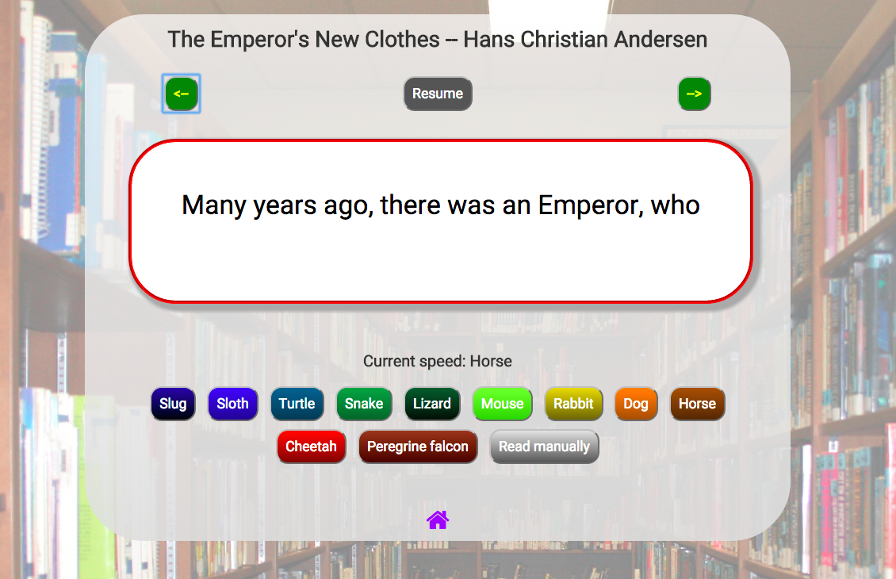

Reading Racer
==============

Education game for developing reading speed and comprehension. The most recent stable version is deployed here: https://readingracer.herokuapp.com/.

Users can read stories that are shown in small text selections (40-55 characters) at varying speeds (represented by various animals). Users can also use arrow keys to manually read through the story.

Future enhancements will include user accounts to record progress and award badges. Parents/teachers will be able to manage multiple accounts for children, including adding 'scores' for offline reading achievements.




### Installation
Reading Racer is written in Ruby 2.1.3/Rails 4.1.6. To set up:

```
git clone https://github.com/jbwhite/reader.git
```

Run bundle:

```
bundle install
```

Start the server:

```
rails s
```

### Development status

Reading racer is in early stage development.

